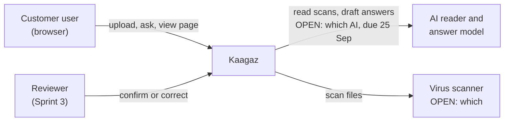
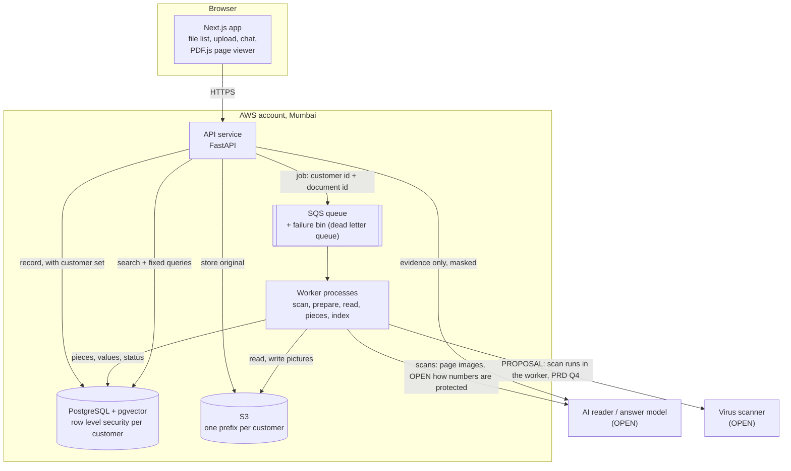
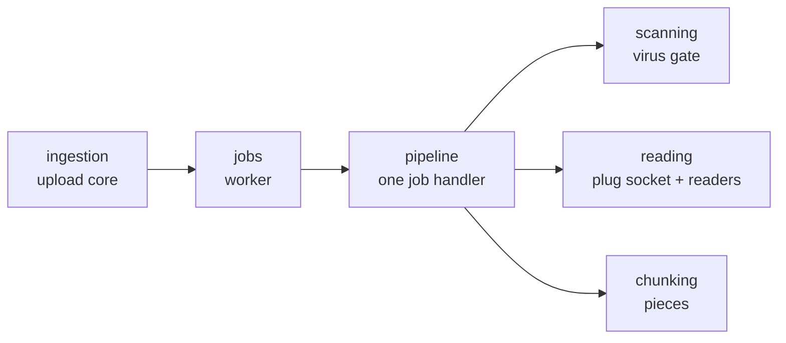

# 01. Overview

## Goals (from the Delivery Plan)

| Sprint | Ends | Goal |
|---|---|---|
| 1 Foundation | Tue 29 Sep | Files uploaded, stored safely, clean digital files read. Customers separated. |
| 2 The Answer (MVP) | Wed 7 Oct | A question gets an answer that points to the exact page and spot. Scans included. |
| 3 Trust | Wed 14 Oct | Answers labelled verified or needs review. Corrections remembered per customer. |
| 4 Launch | Thu 22 Oct | Safe, measured, live, on a recorded go or no go decision. |

Not at launch: reading Hindi or Devanagari documents.

## Users

| User | Does |
|---|---|
| Customer user | Uploads documents, asks questions, opens the highlighted source page |
| Reviewer (Sprint 3) | Checks values marked needs review, picks the right reading |
| Admin (Sprint 4) | Adds customers and users, sets limits |

## Quality targets

Numbers marked OPEN are set by Vrushit (the go or no go bar is due Fri 16 Oct).

| Quality | Target | Source |
|---|---|---|
| Customer separation | Zero cross-customer reads, proven by tests on every pull request | CLAUDE.md, never cut |
| Answers without a source | Zero, proven by test | Plan, Sprint 2 testing |
| Confidently wrong answers on the golden set | Zero | Plan, Sprint 2 gate |
| Upload size limit | OPEN | PRD section 6 |
| Time from upload to searchable | OPEN (measured in #24) | Plan, Sprint 1 testing |
| Answer time | OPEN | not in the plan |
| Availability | OPEN | not in the plan |
| Region | AWS Mumbai (ap-south-1); where AI calls are processed is OPEN | README, stack |

## Context: who talks to the system

## Containers: the main parts

The stack as stated in CLAUDE.md and README.md: Next.js with PDF.js, Python with FastAPI,
PostgreSQL with pgvector, S3, SQS with worker processes, AWS CDK.

## How the code is organised (local branch)

Each step is its own small package. Outside systems sit behind small
interfaces ("ports"), so the real database, storage, queue and scanner plug in
without changing the steps.

| Package | Issue | State |
|---|---|---|
| `ingestion` | #14 | Built, tested with fakes |
| `jobs` | #16 | Built, tested with a lease-queue fake |
| `scanning` | #15 | Built, no real scanner yet |
| `reading` | #19, #21 | CSV built; Excel and PDF not yet; socket provisional |
| `chunking` | #20 | Rows built; PDF text blocks not yet |
| `pipeline` | glue | Built; preparation (#17) and page pictures (#18) not yet |
