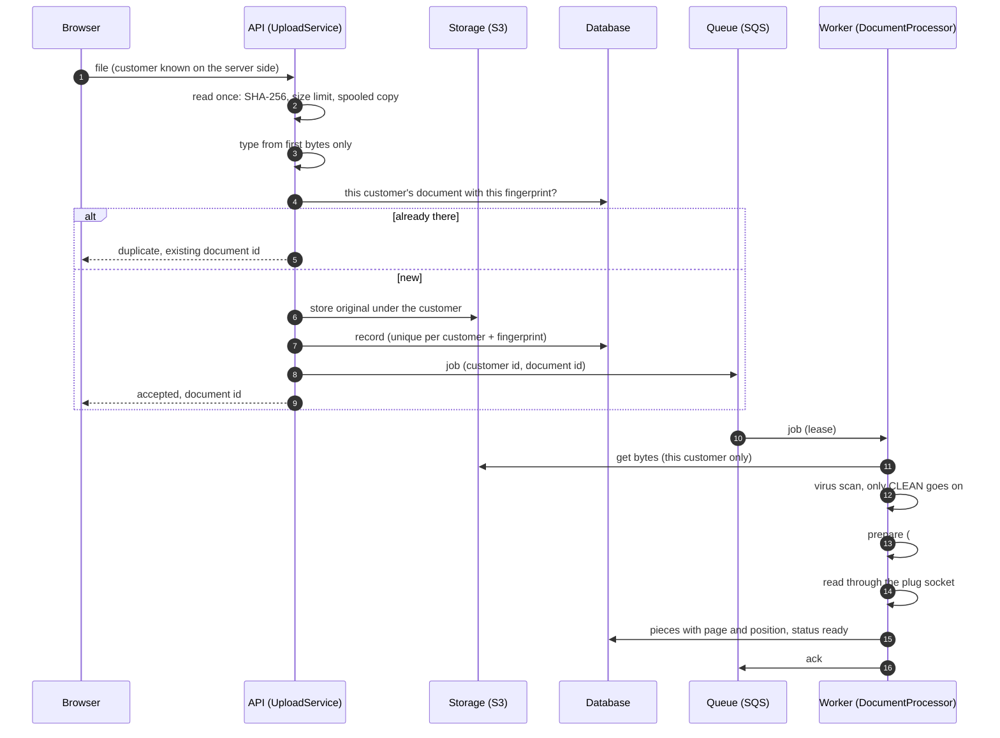
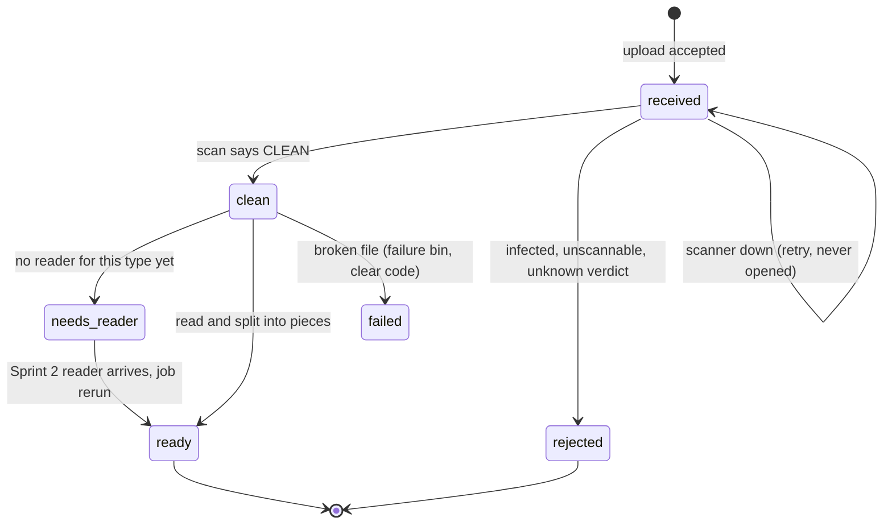

# 02. Ingestion: from upload to text pieces

## The journey of one file

Where the virus scan runs (here: first worker step) is a PROPOSAL until PRD
question 4 is answered.

## Document states

`rejected` files are quarantined: normal reads cannot reach them. Every step
after the scan checks the status is `clean` before it opens the file.

## What happens when a step fails

| Where | Failure | What happens | Why |
|---|---|---|---|
| Upload | Empty, too large, type not allowed | Refused with a code, nothing kept | Reading stops one byte past the limit |
| Upload | Storage down | Error, nothing recorded | Invariant: a record means a stored file |
| Upload | Database down | Stored file deleted, error | Same invariant |
| Upload | Queue down | Record and file removed, error; if removing the record fails, both are kept (no job) for later clean-up | Otherwise a retry would be called a duplicate of a document that never runs; a record never points at a deleted file |
| Upload | Two identical uploads at once | One wins; the loser deletes its copy and returns the winner | Unique (customer, fingerprint) in the database |
| Worker | Handler reports a retryable failure | Lease runs out, job comes back later | Fixed back-off, no busy loop |
| Worker | Permanent failure (virus, broken file) | Straight to the failure bin with its code | Retrying cannot fix it |
| Worker | Bug (unexpected exception) | Not acked, comes back, failure bin after max attempts | No blanket catch |
| Worker | Job runs longer than its lease | Handler heartbeat renews the lease | Not handed to a second worker |
| Worker | Same job delivered twice | Pieces are replaced, not appended | Queues deliver at least once |
| Worker | A later scan rejects the file | Status stays rejected for good; its pieces are removed | Content judged infected must not stay searchable |
| Worker | Job names another customer's document | Not found, failure bin, nothing read or written | Every lookup is by (customer, document) |

## Data structures and costs

| Part | Structure | Cost |
|---|---|---|
| Fingerprint and size check | One streaming pass, SHA-256 | O(n) time; reads at most limit + 1 bytes; memory O(chunk + spool threshold) |
| Type detection | Fixed table of magic numbers | O(len(head)), head capped at 4 KiB |
| Duplicate check | Unique index on (customer, fingerprint) | O(log n) in PostgreSQL; O(1) in the in-memory fake |
| Queue (test fake, same model as SQS) | Deque for waiting jobs, heap by lease expiry, dict by id, lazy deletion | receive O(log n) amortised; ack and extend O(1) + O(log n) |
| Reader dispatch | Dict from file type to reader | O(1) |
| CSV reading | One pass | O(n) time and memory, bounded by the upload limit |
| Row pieces | One stable sort by (sheet, row, column), then group | O(n log n); O(n) when cells arrive in order |

## Not built yet, and why

| Step | Needs |
|---|---|
| HTTP endpoint | FastAPI package approval; how the server knows the customer (PRD Q3) |
| Real storage, database, queue | #9 local setup, #11 naming rule, #12 database with separation |
| Real virus scanner | Scanner choice and where it runs (PRD Q4) |
| File preparation (#17) | Office-to-PDF and photo conversion libraries |
| Page pictures (#18) | Rendering library, resolution (not yet asked in the PRD) |
| Excel reader | Zip and XML limits are security settings; library or own parser is Vrushit's call |
| PDF text with positions | PDF library, coordinate convention (#3, PRD Q5) |
| Identity masking | Vrushit's masking rule (PRD Q1); must exist before any real text is stored |
