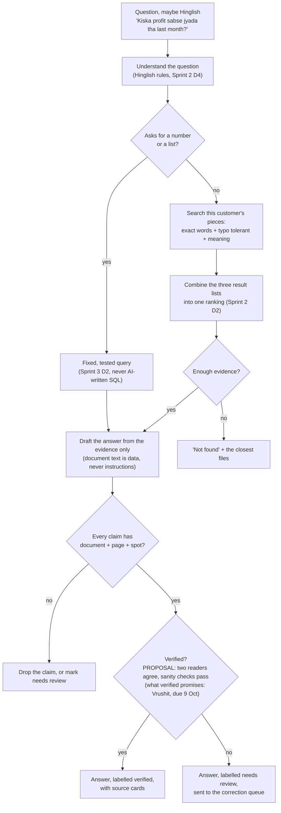

# 03. Answering: from a question to a cited answer (Sprints 2 and 3)

Nothing on this page is built. It follows the Delivery Plan's Sprint 2 and 3
tasks; the details are **PROPOSAL** until Vrushit's designs land (search
design, answer rules, Hinglish rules, router rules, verified meaning).

## The flow

## Rules this flow must keep

| Rule | Where it is enforced |
|---|---|
| Every query is for the current customer only | Database row level security, plus search always filtered by customer |
| No source, no answer | A check after drafting: claims without a piece id and position are removed |
| Numbers never come from AI-written SQL | Only fixed queries, written and tested by Vrushit (Sprint 3 D2) |
| Document text is untrusted | Evidence goes in as quoted data; links, images and markup are stripped before the answer (Sprint 4 D1) |
| Not found is a valid answer | The "enough evidence" gate; ten unanswerable questions must all say not found (Sprint 2 testing) |
| No full identity number reaches an AI prompt | Text is masked at capture. OPEN: the Sprint 2 scan reader receives page images, which text masking cannot touch; depends on Vrushit's reader choice (due Fri 25 Sep) and never-do 3 |

## Search, in simple terms

Three searches run over the same pieces and their results are combined:

| Search | Finds | Built on |
|---|---|---|
| Exact words | "INV-1042" | PostgreSQL full text search |
| Typo tolerant | "invioce" finds "invoice" | PostgreSQL fuzzy matching (trigram) |
| Meaning | "highest profit" finds "net income was largest" | pgvector embeddings of each piece |

How they are combined is Vrushit's search design (Sprint 2 solution design).
One common choice is reciprocal rank fusion, which needs no tuning of scores
across the three: **PROPOSAL**, not decided.

## The source card

Each answer shows one card per source: the document (whether its name is
stored and shown is OPEN, see 04), the page, and a
button that opens the page in the PDF.js viewer with the box drawn at the
piece's position. This is why Sprint 1 stores a position with every piece.

## Corrections (Sprint 3)

The plan: two independent readers read the same page; where they disagree, a
reviewer sees both readings side by side and picks one. The correction becomes
the stored truth for that customer only, and the original file never changes.
Tushar's own idea (click a flagged word and type the fix, retake a phone
photo) is raised as PRD question 10 and is not in the plan.
