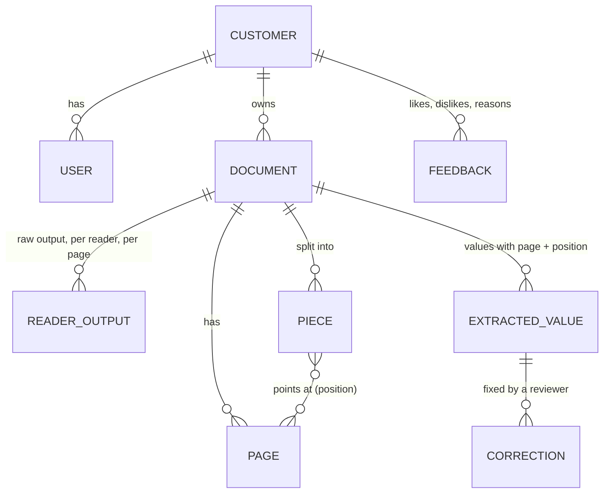
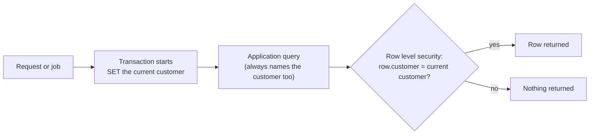

# 04. Data and customer separation

The database design is Vrushit's (#1). This page lists the **information** the
system needs, taken from the plan and the issues, as input for that design. It
is not a schema.

## What the system keeps

| Thing | Must hold (from the issues and CLAUDE.md) |
|---|---|
| Document | customer, fingerprint (unique per customer), size, detected type, status, failure code. OPEN: the file name. The local code stores none (it can hold a PAN), but the file list (#22) and the source card need something to show. |
| Page | document, page number, width and height, picture location |
| Reader output | the raw output, kept whole, per page and per reader, with which reader and version made it |
| Piece | document, text, every place it covers (page and position, per line), for search and citation |
| Extracted value | cleaned value, raw value, page, position, verified or needs review |
| Correction | old value, new value, who, when; for one customer only |

Every table carries the customer (#1 acceptance criteria).

## Customer separation: two locks, not one

1. **The database lock.** Row level security on every table, switched on from the
   first table (#12). The application connects as a restricted role that is not a
   superuser, does not own the tables, and does not have BYPASSRLS. PostgreSQL
   lets superusers and table owners skip the rules, so the test role must be
   neither (PRD question 8, raised on #12).
2. **The application lock.** Every port method takes the customer first. There is
   no method that lists across customers, in product code or in test fakes.

The isolation tests (`isolation` marker) check the application lock and file
storage against in-memory fakes, with the same bytes uploaded by two customers
and with forged ids. The database lock is untested until #12 exists.

## File storage layout: principles, not the naming rule

The naming rule is Vrushit's (#11). PROPOSAL, principles it could keep:

| Principle | Why |
|---|---|
| One prefix per customer | Plan: "one prefix per customer" |
| Objects named by a random id, never by the file name or the fingerprint | A name can hold a PAN; a fingerprint in a key lets someone test whether a file exists |
| Originals are never overwritten | Corrections change extracted text, never the file; the original is the audit record |
| Quarantine is out of reach of normal reads | A rejected file must never be processed or served |
| Derived files (prepared PDF, page pictures) sit next to the original, under the same customer | Separation holds for every file |

## Identity numbers (Aadhaar, PAN)

**OPEN:** the masking rule is Vrushit's (PRD question 1). What the plan and
CLAUDE.md already require: mask at the moment of capture, before storage and
before indexing, in text, raw output, logs, traces, errors and AI prompts.
PROPOSAL, points to decide, raised by the council:

* A GSTIN contains the full PAN, so a PAN pattern must match inside other text.
* Over-masking (a 12-digit invoice number masked by mistake) is safer than
  missing a real number; a checksum filter would miss mistyped numbers.
* "Keep the raw reader output" then means keeping the masked raw output.
* File names need masking too, or must not be stored.
