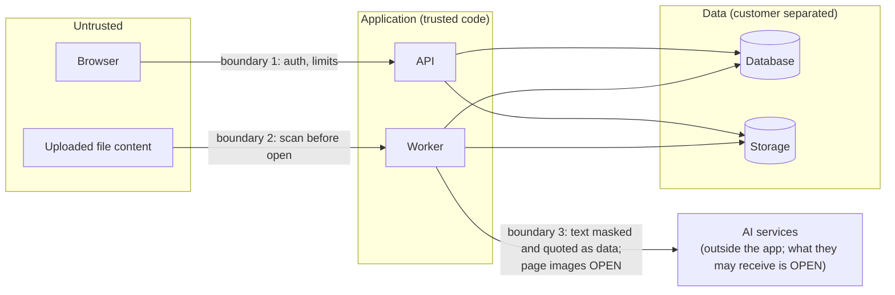

# 05. Security

A STRIDE summary: for each kind of threat, what could go wrong here and the
control. Controls marked **built** exist on the local branch and are tested
against in-memory fakes only: no real storage, database, queue or scanner, and
not yet reviewed by Vrushit.

## Trust boundaries

## Threats and controls

| Threat | Example | Control | State |
|---|---|---|---|
| **Spoofing** | Customer A claims to be customer B | Customer decided on the server, never from the request (PRD Q3); login OPEN | OPEN |
| **Tampering** | Editing ids in a request to reach another customer's file | Every lookup by (customer, id); row level security | built (app lock), OPEN (database) |
| **Tampering** | A forged job for another customer's document | Worker reads by (customer, document); not found = failure bin | built |
| **Repudiation** | "I never changed that value" | Corrections store who and when (Sprint 3) | not started |
| **Information disclosure** | Duplicate check reveals another customer holds a file | Duplicates checked per customer only | built |
| **Information disclosure** | Error messages or logs quote file content or identity numbers | Errors carry codes only, parser errors re-raised `from None`, no file names stored | built |
| **Information disclosure** | Isolation test passes because it runs as a superuser | Tests connect as a restricted, non-owner role | OPEN (#12) |
| **Denial of service** | Huge upload fills memory | Reading stops one byte past the limit; spool moves to disk | built |
| **Denial of service** | A poison file blocks the queue for everyone | Leases, max attempts, failure bin, redelivery to the back of the line | built |
| **Denial of service** | Zip bomb, XML entity bomb, decompression bomb in images | Caps that count real bytes, reject DOCTYPE, pixel limits | OPEN (Excel, images not built) |
| **Elevation of privilege** | A malicious file runs code in a converter or viewer | Virus scan first; PDF.js 4.2.67+ (CVE-2024-4367); converters without network; macros refused | built (gate), OPEN (rest) |
| **Elevation of privilege** | Document text tells the AI to ignore its rules | Document text is data, never instructions; output cleaned of links and markup (Sprint 4) | not started |

## The virus gate in one line

Deny by default: only an explicit CLEAN verdict lets a file through; scanner
errors retry without opening the file; infected or unscannable files are
quarantined; every later step re-checks the clean status. **Built.**

## Secrets and dependencies

* No secrets in the repo; the CI checks for key shapes (CLAUDE.md never-do 4).
* No new library without Vrushit's approval, with its licence; AGPL, SSPL and
  GPL v3 are refused (MinIO is AGPL-3.0, so it is out).
* The local code uses the Python standard library only.
