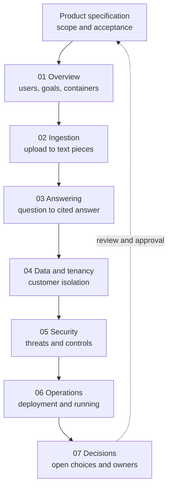

# Kaagaz system design

**Status:** Proposal by Tushar, drafted with Claude Code on 25 Sep 2026.
**Owner of every decision here:** Vrushit (CLAUDE.md: "all solution design,
cloud, database, deployment, security"). Nothing in this folder is decided until
he writes it into `docs/decisions/`.

Sources: the Delivery Plan v2, CLAUDE.md, README.md, the Sprint 1 PRD, and the
code on branch `local/s1-foundation` (unreviewed, tested only against in-memory
fakes). Anything not in those sources is marked **PROPOSAL** or **OPEN**.

## Visual map

Read the [full Sprint 1 product specification](../prd/sprint-1.html) first for
the scope and acceptance criteria, then use this design set to trace each
requirement into the working system.

## Pages

| Page | What it covers |
|---|---|
| [01-overview.md](01-overview.md) | Goals, users, quality targets, the big picture (context and container diagrams) |
| [02-ingestion.md](02-ingestion.md) | How a file becomes text pieces: upload, scan, prepare, read, pieces. States and failures. |
| [03-answering.md](03-answering.md) | How a question becomes a cited answer (Sprints 2 and 3) |
| [04-data-and-tenancy.md](04-data-and-tenancy.md) | Data the system keeps, customer separation, storage layout, identity masking |
| [05-security.md](05-security.md) | Threat model and the controls for each threat |
| [06-operations.md](06-operations.md) | Deployment on AWS, observability, scaling, cost, backups |
| [07-decisions.md](07-decisions.md) | Every open decision, who owns it, when it is due, and what it blocks |

## The product in one paragraph

Customers upload business documents (invoices, registers, receipts, statements,
forms) and ask questions about them in chat, including Hinglish questions. Every
answer carries its source: the document, the page, and the exact spot, highlighted.
If the documents do not contain the answer, the system says so. Several customer
companies share one system and never see each other's data. English documents
only at launch.

## The five rules the design is built around

1. **Customers never cross.** Every query runs with the current customer set; the database refuses anything else.
2. **Identity numbers are masked at capture.** No full Aadhaar or PAN reaches a table, log, trace, error or AI prompt.
3. **No source, no answer.** Every value carries its document, page and position.
4. **Verified or needs review, never guessed.** "Unreadable" and "not found" are valid answers.
5. **Readers sit behind one plug socket.** Swapping the AI that reads scans touches one module.
